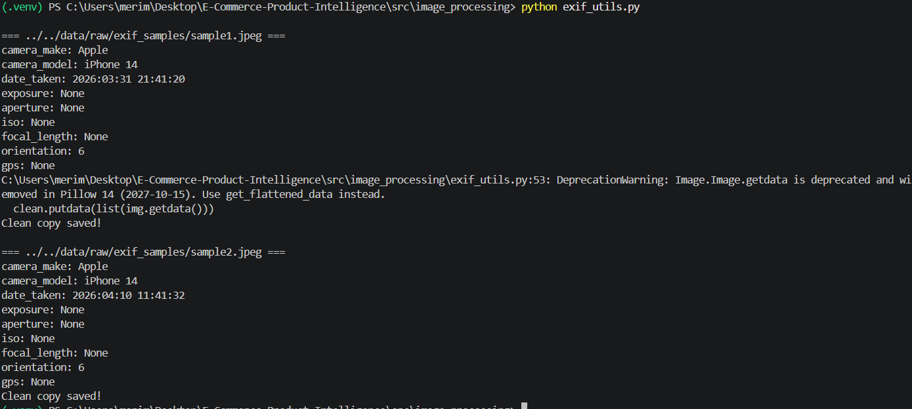

# E-Commerce-Product-Intelligence
E-Commerce Product Intelligence

This project focusing on analyzing data from data e-commerce platform to gain insights into product popularity, customer preferences, and consumption trends. Based on the analysis of this data, a model will be developed to predict the success of products in the market.

Data sources: 
* Fake Store API
* DummyJSON

Data types we will handle:
* Numerical data - product prices, number of sales, ratings.
* Textual data - Product reviews, product descriptions
* Categorical data - Product categories, product types
* Temporal data - date the product was listed for sale, date of the last sale

Expected Challenges:
* Data quality issues – Data from different platforms may be incomplete, inaccurate, or unstructured.
* Data integration – Merging data from different sources can be challenging.
* Storage of large data volumes – Working with large amounts of data can be resource-intensive.
* Data modeling – Creating accurate predictive models can be complex, especially when the data is not fully structured.
Pipeline architecture diagram:
  

Success criteria: 
* Predictive model accuracy – The model must have high accuracy in predicting product success (e.g., accurately forecasting which products should be promoted).
* Usability of visualizations – Charts and reports must be clear and useful for end users (e.g., e-commerce platform managers).
* Data coverage – The system should analyze and integrate data from at least two sources (Amazon and eBay).
* Data quality – The data must be cleaned and prepared for analysis without significant errors.

Google Drive folder link: https://drive.google.com/drive/folders/1RJ0sv1qmjA9Jw5WA-d2E2NVNZUuvLith

